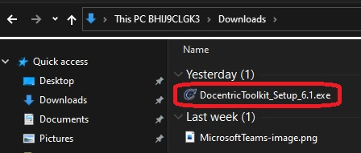
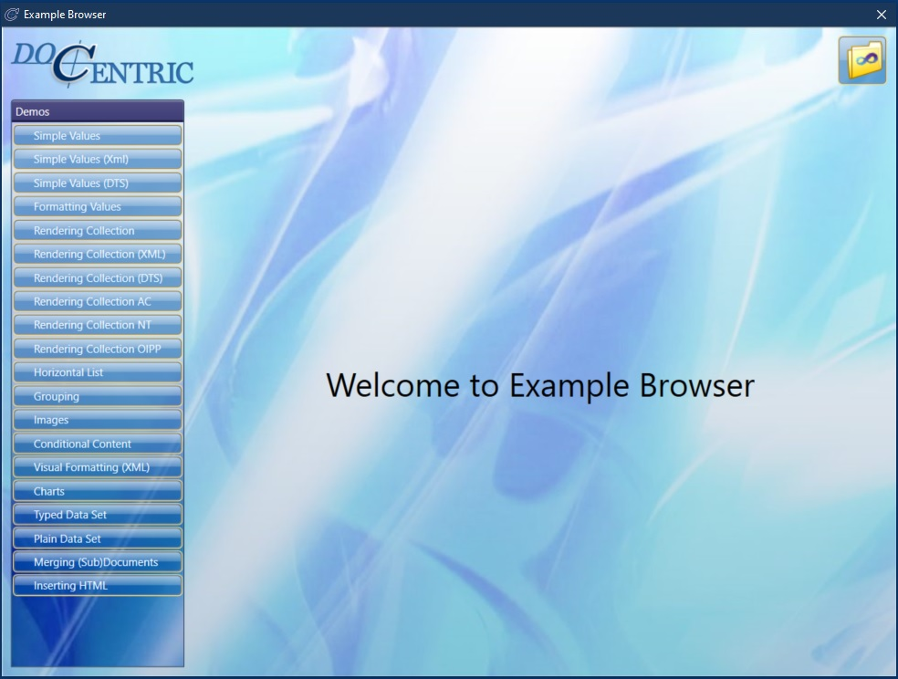
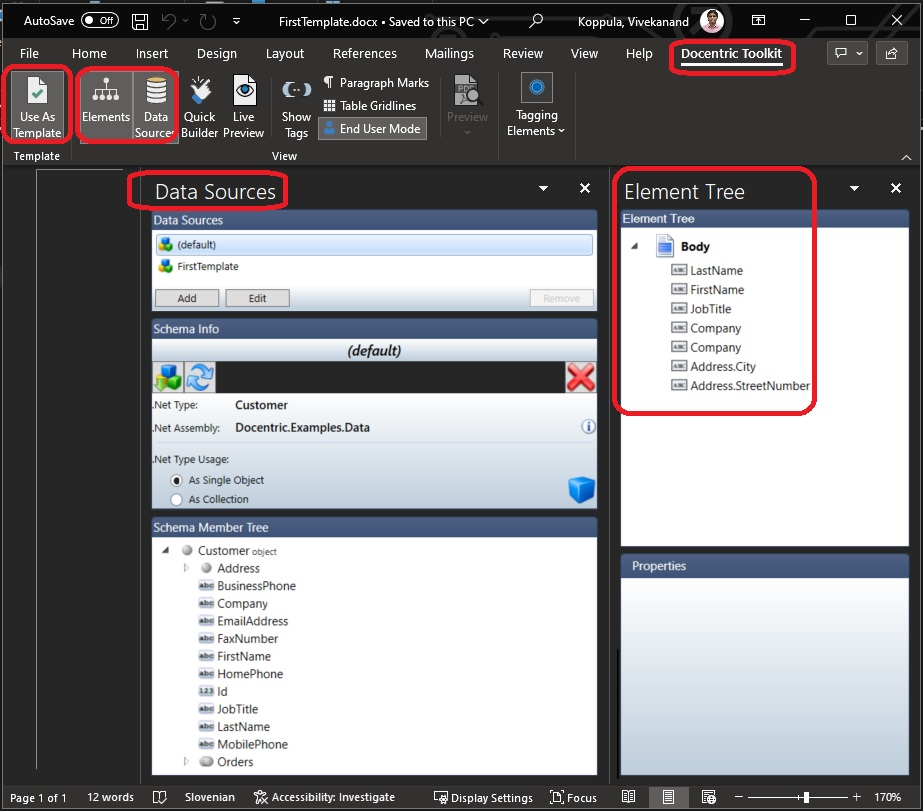
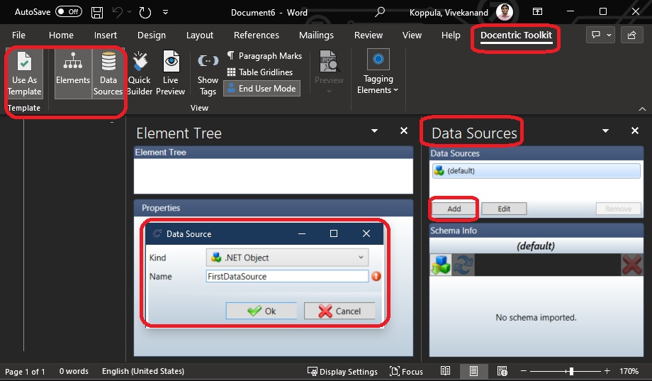
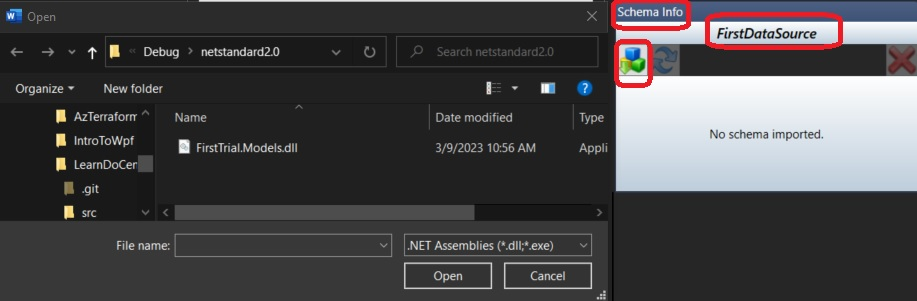
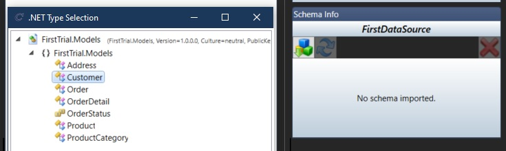
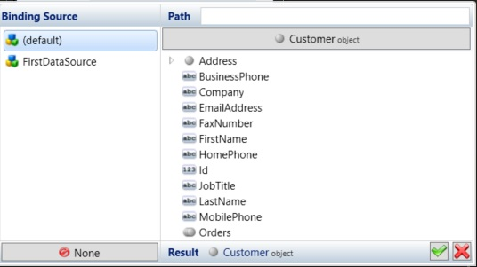

# Getting Started.

1. Go [here to the download page](https://www.docentric.com/download)




2. Once installed, you should be able to run the Example Browser



3. Also when you open ms word, you should be see do centric tool kit.



# Now time to create a template. Follow the steps.

1. Create a new blank word document. Then ensure Main Menu -> Docentric Toolkit -> Use As Template is selected. See the above image.

2. Add a new Data Source by clicking the Add button and giving it a name.



3. Now to add a schema click the button as follows. Then select a dll as follows.


4. Select a dll. 



5. The dll must be produced by a dotnet standard 2.0 project such as follows.

```xml
<Project Sdk="Microsoft.NET.Sdk">

  <PropertyGroup>
    <TargetFramework>netstandard2.0</TargetFramework>
    <Nullable>enable</Nullable>
	<LangVersion>11.0</LangVersion>
  </PropertyGroup>

</Project>

```

6. Select a type



7. Binding a source to field



8. Now run the app.